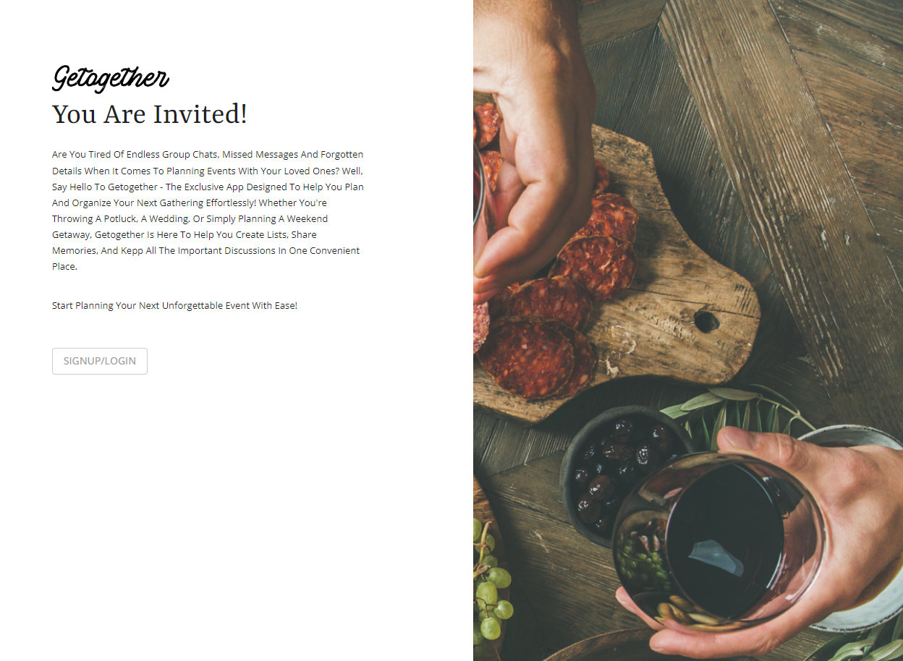
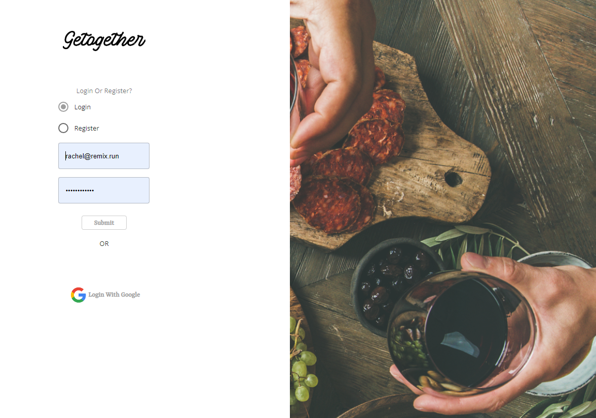
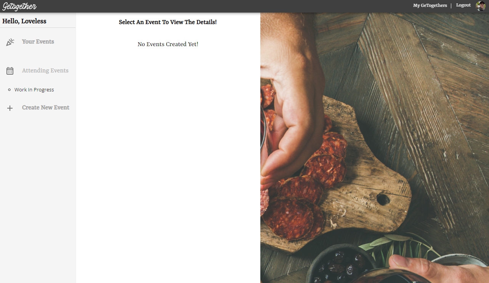
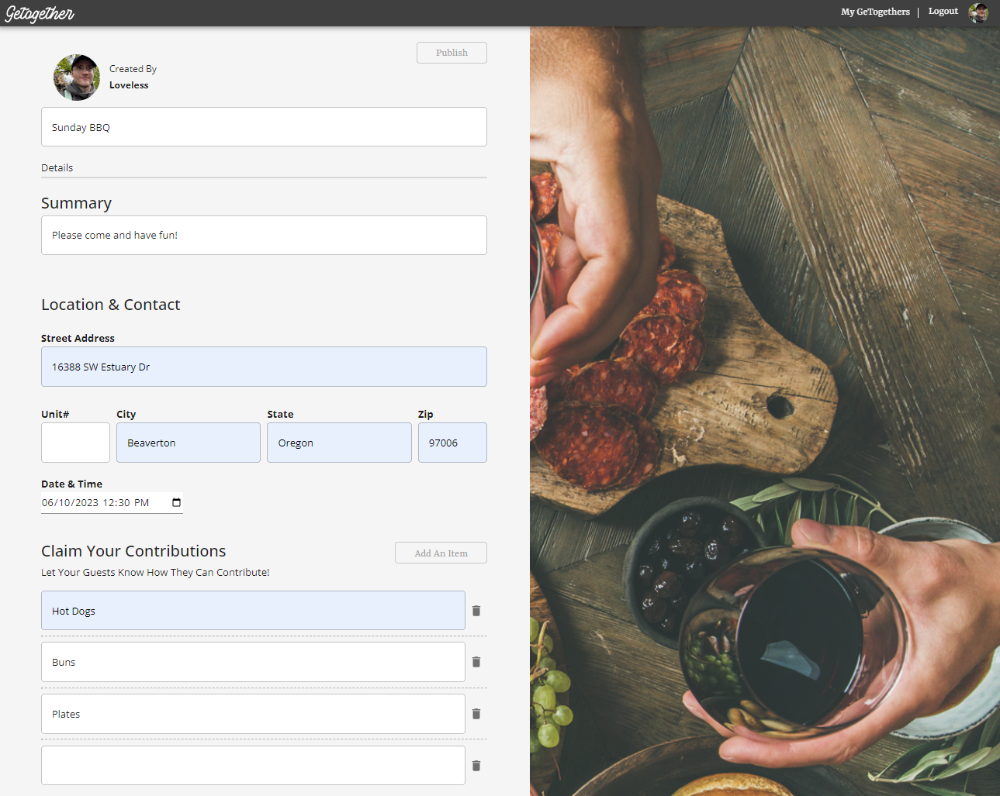
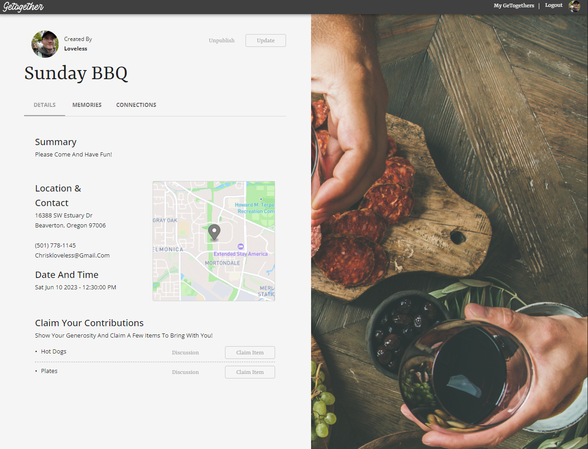
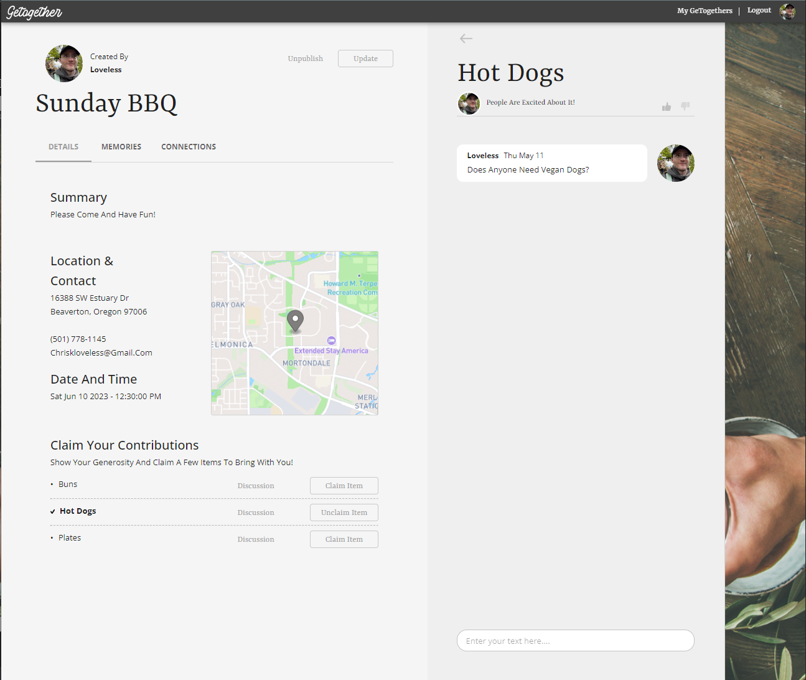

# EyeCue Lab Spring 2023 Internship: GeTogether

## Authors: David Gamble and Chris Loveless

Check Out the Live Site: [getogether.fly.dev](https://getogether.fly.dev/) 

## Description:

GeTogether is a robust web application built with Remix and Typescript while utilizing Postgres as the database management system. The app facilitates the creation and management of potluck style events, allowing users to organize and coordinate gatherings seamlessly. In addition to its powerful event management capabilities, the app employs Socket.io, a real-time communication library, to enable live communication between users associated with the events, fostering interactive and engaging experiences. With its combination of Typescript, Postgres, and Socket.io, GeTogether provides a reliable and dynamic platform for users to plan and participate in potluck events.

## Website 













## Project Setup 

1. Clone this repo to your desktop.
2. Navigate to the project directory and run `$ npm install`.
3. Add a `.env` file to the `.gitignore` and commit the change.
4. Add a `.env` file to the root directory.
5. Use the template provided to declare environment variables.

## Available Scripts

From your terminal:

```sh
npm run dev
```

This starts your app in development mode, rebuilding assets on file changes.

## Run Socket.io Server and App Server concurrently on LocalHost

```sh
$ npm run start 
```

This starts your app in development mode, rebuilding assets on file changes.

## Deployment

First, build your app for production:

```sh
npm run build
```

Then run the app in production mode:

```sh
npm start
```

Now you'll need to pick a host to deploy it to.

### DIY

If you're familiar with deploying node applications, the built-in Remix app server is production-ready.

Make sure to deploy the output of `remix build`

- `build/`
- `public/build/`

## License
Copyright (c) 2023 David Gamble and Chris Loveless 
_[MIT](https://choosealicense.com/licenses/mit/)_


